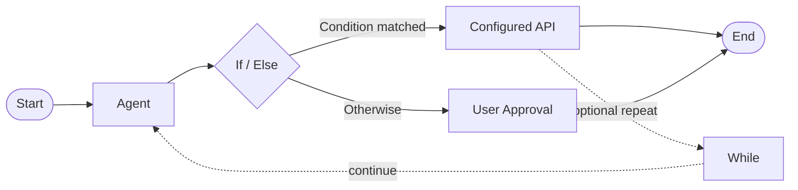
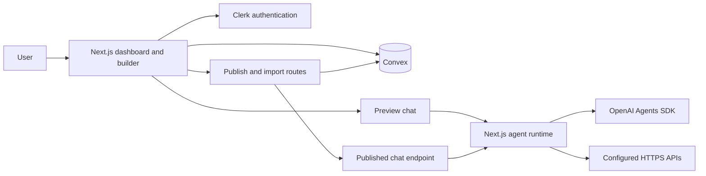

<div align="center">

# ✦ Alpha Agents

### Design the workflow. Bring the agent to life.

Build AI agents visually, connect them to tools, test them in a live preview, and publish them behind a shareable chat endpoint.


**From a blank canvas to a working AI workflow—one connected step at a time.**

### 🎥 Project Preview

[▶️ **Watch Alpha Agents — Project Preview**](https://drive.google.com/file/d/1RzshHoT3rZTheUZ5Di8-6AuIC2M2lrbi/view?usp=sharing)

</div>

---

## What is Alpha Agents?

Alpha Agents is a visual workspace for creating conversational AI agents from workflows. Describe what an agent should do, connect its steps on a canvas, configure tools, and test the result before publishing it.

The workflow is the source of truth: Preview and published agents use the saved workflow and its generated runtime configuration rather than a separate hard-coded response.

## At a glance

| Design | Configure | Test | Share |
| --- | --- | --- | --- |
| Build workflows on a visual canvas. | Give agents instructions and connect API tools. | Chat with the saved workflow in Preview. | Publish an endpoint and copy a TypeScript client snippet. |

### Workflow building blocks

The canvas includes these nodes:

- **Start** — entry point for a user's message.
- **Agent** — instructions and behavior for an AI step.
- **If / Else** — route the workflow based on a condition.
- **While** — repeat a workflow step while a condition holds.
- **User Approval** — add a human review step.
- **API** — call a configured external API.
- **End** — define a workflow exit and output.



## Highlights

### Visual agent builder

Create and connect workflow nodes with React Flow, configure each node in the settings panel, save the graph, and return to edit it at any time.

### Workflow-aware Preview

Preview chats with the selected agent using the saved workflow configuration and OpenAI Agents SDK. Add instructions, tools, and API parameters to shape how the agent responds.

### Reusable templates

Saved workflows can appear in the Templates tab. Their descriptions are generated from the workflow's actual configuration. **Use Template** creates a separate agent copy with new node and edge IDs, so edits to the copy do not alter the source.

### Publish and integrate

Publish a saved, rebooted workflow to create a server-side snapshot and a chat endpoint. The **Code** dialog provides a TypeScript client snippet for calling that endpoint. Unpublishing revokes the endpoint.

The snippet is an API client, not a copy of the workflow graph. To import a published workflow, use **Code → Paste Code to Import Flow** in the same app deployment that published it. The imported workflow is independent, and API credentials are cleared so the new owner can configure their own.

### Authentication and persistence

Clerk handles sign-in and protected workspace routes. Convex stores user and agent records, workflow data, published snapshots, conversation metadata, and usage counters.

## How the pieces fit together



## Tech stack

- **Next.js App Router** and **React** for the web application and server routes
- **TypeScript** for application and workflow types
- **React Flow** for the node-based workflow editor
- **Convex** for reactive application data and workflow persistence
- **Clerk** for authentication and plan-aware access
- **OpenAI Agents SDK** and the OpenAI API for agent runtime and workflow analysis
- **Tailwind CSS** and shadcn-style UI components for the interface
- **Arcjet** for the included rate-limiting example route

## Run locally

### Prerequisites

- Node.js and npm
- A Clerk application
- A Convex deployment
- An OpenAI API key

### 1. Install dependencies

```bash
npm ci
```

### 2. Configure environment variables

Create a `.env.local` file in the project root. Add your own credentials; never commit this file.

```dotenv
# Clerk
NEXT_PUBLIC_CLERK_PUBLISHABLE_KEY=your_clerk_publishable_key
CLERK_SECRET_KEY=your_clerk_secret_key
NEXT_PUBLIC_CLERK_SIGN_IN_URL=/sign-in
NEXT_PUBLIC_CLERK_SIGN_UP_URL=/sign-up

# Convex
NEXT_PUBLIC_CONVEX_URL=https://your-deployment.convex.cloud

# OpenAI — used by Preview and workflow analysis
OPENAI_API_KEY=your_openai_api_key

# Publishing and workflow import (server-only)
CONVEX_DEPLOY_KEY=your_convex_deployment_key
NEXT_PUBLIC_APP_URL=http://localhost:3000

# Optional — used by the Arcjet example route
ARCJET_KEY=your_arcjet_key
```

Keep `CLERK_SECRET_KEY`, `OPENAI_API_KEY`, `CONVEX_DEPLOY_KEY`, and `ARCJET_KEY` server-only. Do not prefix them with `NEXT_PUBLIC_` or add their values to source control. `NEXT_PUBLIC_APP_URL` should be set to your deployed app origin in production. Convex CLI can configure the development deployment URL when you run `npx convex dev`.

### 3. Start Convex

In one terminal, from the project root:

```bash
npx convex dev
```

Sign in to Convex and select or create a development deployment. This syncs the schema and functions while the command remains running.

### 4. Start Next.js

In a second terminal:

```bash
npm run dev
```

Open [http://localhost:3000](http://localhost:3000). The landing page sends signed-out visitors to sign-up and redirects signed-in visitors to the dashboard.

## Create and publish an agent

1. Sign in and create an agent from the dashboard.
2. Add workflow nodes and connect them on the canvas.
3. Configure the Agent instructions and any API tools the workflow needs.
4. Save the workflow, then open Preview and select **Reboot Agent** to refresh its runtime configuration.
5. Test the workflow in the Preview chat.
6. Select **Publish Agent** to create or update the published snapshot.
7. Open **Code** to copy the client snippet or import a published workflow.

For publishing setup, endpoint behavior, and import details, see [PUBLISHING.md](./PUBLISHING.md).

## Deploy

For a production deployment:

1. Configure production Clerk keys, `OPENAI_API_KEY`, `NEXT_PUBLIC_CONVEX_URL`, and `CONVEX_DEPLOY_KEY` in your hosting provider's environment settings.
2. Set `NEXT_PUBLIC_APP_URL` to the public origin of the deployed app.
3. Deploy the Convex schema and functions with `npx convex deploy` against the production deployment.
4. Build and deploy the Next.js app with `npm run build` and your chosen Next.js host.
5. Confirm that Clerk production URLs and the Convex production deployment match the deployed app.

Keep development and production credentials in their respective environments.

## Published endpoint notes

- The generated TypeScript snippet calls `/api/published-agents/{publicAgentId}/chat`.
- The workflow graph is stored on the server; it is not embedded in the snippet.
- The public ID is a shareable access link. Unpublish the agent to revoke it.
- Published agents are limited to **30 requests per minute**; message and request sizes are bounded.
- Configured API calls in the published runtime require public HTTPS hosts. Private and local network targets are rejected, DNS is pinned for the request, and redirects are not followed.
- Workflow imports require the source publication to exist in the same app deployment. Imported API credentials are removed.

## Project structure

```text
app/
├── (auth)/                 Clerk sign-in and sign-up pages
├── agent-builder/          Workflow canvas, node settings, and Preview
├── api/                    Agent chat, analysis, publishing, and import routes
└── dashboard/              Agent list, templates, billing, and profile
convex/                     Schema, queries, mutations, and scheduled cleanup
components/                 Shared UI components
config/                     OpenAI and Arcjet clients
context/                    User and workflow state
lib/                        Agent runtime and server-side Convex client
types/                      Shared TypeScript types
```

## Useful commands

| Command | Description |
| --- | --- |
| `npm run dev` | Start the Next.js development server. |
| `npm run build` | Create a production build. |
| `npm start` | Serve the production build. |
| `npx convex dev` | Sync and watch the development Convex deployment. |
| `npx convex deploy` | Deploy Convex functions and schema to production. |

## Security essentials

- Keep environment files and credentials out of GitHub. Rotate any key that has been exposed.
- Use `CONVEX_DEPLOY_KEY` only on the server. It authorizes internal publishing and import operations.
- Treat a published endpoint as public to anyone who has its URL; unpublish it to revoke access.
- Never put private credentials in frontend code or in a workflow description.
- Review each configured API endpoint and its access policy before publishing an agent.

---

<div align="center">

**Alpha Agents** · Build thoughtfully. Connect clearly. Ship with confidence.

</div>
